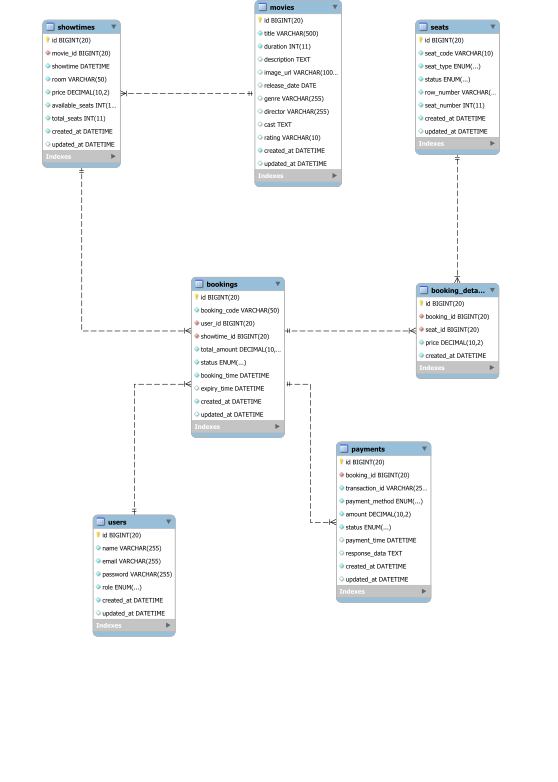

# Database Design

# Thiết kế cơ sở dữ liệu

---

# 1. Mục đích

Tài liệu này mô tả thiết kế cơ sở dữ liệu cho hệ thống Đặt Vé Xem Phim Trực Tuyến, bao gồm các bảng, quan hệ, ràng buộc và chỉ mục nhằm đảm bảo tính toàn vẹn dữ liệu và hiệu năng truy vấn.

---

# 2. Công nghệ

* **Database**: MySQL 8.0+
* **Engine**: InnoDB
* **Charset**: utf8mb4_unicode_ci

---

# 3. Sơ đồ quan hệ (ERD)



---

# 4. Các bảng trong hệ thống

## 4.1. users

Lưu trữ thông tin người dùng.

```sql
CREATE TABLE users (
    user_id BIGINT AUTO_INCREMENT PRIMARY KEY,
    username VARCHAR(50) NOT NULL UNIQUE,
    email VARCHAR(255) NOT NULL UNIQUE,
    password VARCHAR(255) NOT NULL,
    full_name VARCHAR(255) NOT NULL,
    phone_number VARCHAR(20) NOT NULL,
    role ENUM('ROLE_USER', 'ROLE_ADMIN') NOT NULL DEFAULT 'ROLE_USER',
    created_at DATETIME NOT NULL DEFAULT CURRENT_TIMESTAMP,
    updated_at DATETIME NULL ON UPDATE CURRENT_TIMESTAMP
) ENGINE=InnoDB DEFAULT CHARSET=utf8mb4 COLLATE=utf8mb4_unicode_ci;
```

**Mô tả các trường:**
- `user_id`: Mã định danh duy nhất
- `username`: Tên đăng nhập (unique)
- `email`: Email (unique)
- `password`: Mật khẩu đã mã hóa (BCrypt)
- `full_name`: Họ và tên
- `phone_number`: Số điện thoại
- `role`: Vai trò (ROLE_USER, ROLE_ADMIN)

---

## 4.2. movies

Lưu trữ thông tin phim.

```sql
CREATE TABLE movies (
    id BIGINT AUTO_INCREMENT PRIMARY KEY,
    title VARCHAR(500) NOT NULL,
    duration INT NOT NULL COMMENT 'Duration in minutes',
    description TEXT,
    image_url VARCHAR(1000),
    trailer_url VARCHAR(1000),
    release_date DATE,
    genre VARCHAR(255),
    director VARCHAR(255),
    cast TEXT,
    rating VARCHAR(10) COMMENT 'Age rating (e.g., P, C13, C16, C18)',
    created_at DATETIME NOT NULL DEFAULT CURRENT_TIMESTAMP,
    updated_at DATETIME NULL ON UPDATE CURRENT_TIMESTAMP
) ENGINE=InnoDB DEFAULT CHARSET=utf8mb4 COLLATE=utf8mb4_unicode_ci;
```

**Mô tả các trường:**
- `title`: Tên phim
- `duration`: Thời lượng phim tính bằng phút
- `description`: Mô tả phim
- `image_url`: URL ảnh poster
- `trailer_url`: URL trailer
- `release_date`: Ngày phát hành
- `genre`: Thể loại phim
- `director`: Đạo diễn
- `cast`: Diễn viên
- `rating`: Xếp hạng độ tuổi (P: mọi lứa tuổi, C13, C16, C18)

---

## 4.3. cinemas

Lưu trữ thông tin rạp chiếu phim với thông tin thương hiệu.

```sql
CREATE TABLE cinemas (
    id BIGINT AUTO_INCREMENT PRIMARY KEY,
    name VARCHAR(255) NOT NULL COMMENT 'Cinema name (e.g., CGV Vincom Center)',
    brand VARCHAR(100) NOT NULL COMMENT 'Cinema brand/chain (e.g., CGV, Lotte Cinema, Galaxy Cinema)',
    logo_url VARCHAR(1000),
    address VARCHAR(500),
    district VARCHAR(100),
    city VARCHAR(100),
    phone VARCHAR(20),
    website VARCHAR(500),
    description TEXT,
    created_at DATETIME NOT NULL DEFAULT CURRENT_TIMESTAMP,
    updated_at DATETIME NULL ON UPDATE CURRENT_TIMESTAMP,
    INDEX idx_brand (brand)
) ENGINE=InnoDB DEFAULT CHARSET=utf8mb4 COLLATE=utf8mb4_unicode_ci;
```

**Mô tả các trường:**
- `name`: Tên rạp (ví dụ: CGV Vincom Center)
- `brand`: Thương hiệu/chuỗi rạp (ví dụ: CGV, Lotte Cinema, Galaxy Cinema)
- `logo_url`: URL logo thương hiệu
- `address`: Địa chỉ
- `district`: Quận/huyện
- `city`: Thành phố
- `phone`: Số điện thoại
- `website`: Website
- `description`: Mô tả

---

## 4.4. rooms

Lưu trữ thông tin phòng chiếu trong rạp.

```sql
CREATE TABLE rooms (
    id BIGINT AUTO_INCREMENT PRIMARY KEY,
    cinema_id BIGINT NOT NULL,
    name VARCHAR(100) NOT NULL COMMENT 'e.g., Room 1, IMAX, VIP Room',
    capacity INT NOT NULL DEFAULT 0 COMMENT 'Total number of seats',
    room_type VARCHAR(50) COMMENT 'e.g., Standard, IMAX, 4DX, VIP',
    created_at DATETIME NOT NULL DEFAULT CURRENT_TIMESTAMP,
    updated_at DATETIME NULL ON UPDATE CURRENT_TIMESTAMP,
    FOREIGN KEY (cinema_id) REFERENCES cinemas(id) ON DELETE CASCADE,
    INDEX idx_cinema_id (cinema_id)
) ENGINE=InnoDB DEFAULT CHARSET=utf8mb4 COLLATE=utf8mb4_unicode_ci;
```

**Mô tả các trường:**
- `cinema_id`: ID rạp chiếu
- `name`: Tên phòng (ví dụ: Room 1, IMAX, VIP Room)
- `capacity`: Tổng số ghế
- `room_type`: Loại phòng (Standard, IMAX, 4DX, VIP)

---

## 4.5. seats

Lưu trữ thông tin ghế ngồi trong từng phòng chiếu.

```sql
CREATE TABLE seats (
    id BIGINT AUTO_INCREMENT PRIMARY KEY,
    room_id BIGINT NOT NULL,
    row_label VARCHAR(5) NOT NULL COMMENT 'e.g., A, B, C',
    seat_number INT NOT NULL COMMENT 'Seat number in the row',
    seat_type ENUM('REGULAR', 'VIP', 'COUPLE') NOT NULL DEFAULT 'REGULAR',
    surcharge DECIMAL(10,2) NOT NULL DEFAULT 0.00 COMMENT 'Additional price for special seats',
    is_active TINYINT(1) NOT NULL DEFAULT 1 COMMENT 'Soft delete flag',
    created_at DATETIME NOT NULL DEFAULT CURRENT_TIMESTAMP,
    updated_at DATETIME NULL ON UPDATE CURRENT_TIMESTAMP,
    FOREIGN KEY (room_id) REFERENCES rooms(id) ON DELETE CASCADE,
    UNIQUE KEY uk_room_seat (room_id, row_label, seat_number),
    INDEX idx_room_id (room_id)
) ENGINE=InnoDB DEFAULT CHARSET=utf8mb4 COLLATE=utf8mb4_unicode_ci;
```

**Mô tả các trường:**
- `room_id`: ID phòng chiếu
- `row_label`: Ký hiệu hàng (A, B, C, ...)
- `seat_number`: Số ghế trong hàng
- `seat_type`: Loại ghế (REGULAR: thường, VIP: cao cấp, COUPLE: đôi)
- `surcharge`: Phụ thu cho ghế đặc biệt
- `is_active`: Trạng thái hoạt động (1: có thể đặt, 0: không khả dụng)

---

## 4.6. showtimes

Lưu trữ thông tin suất chiếu.

```sql
CREATE TABLE showtimes (
    id BIGINT AUTO_INCREMENT PRIMARY KEY,
    movie_id BIGINT NOT NULL,
    room_id BIGINT NOT NULL,
    cinema_id BIGINT NOT NULL,
    start_time DATETIME NOT NULL,
    end_time DATETIME NOT NULL,
    base_price DECIMAL(10,2) NOT NULL COMMENT 'Base ticket price',
    status ENUM('ACTIVE', 'CANCELLED') NOT NULL DEFAULT 'ACTIVE',
    created_at DATETIME NOT NULL DEFAULT CURRENT_TIMESTAMP,
    updated_at DATETIME NULL ON UPDATE CURRENT_TIMESTAMP,
    FOREIGN KEY (movie_id) REFERENCES movies(id) ON DELETE CASCADE,
    FOREIGN KEY (room_id) REFERENCES rooms(id) ON DELETE CASCADE,
    FOREIGN KEY (cinema_id) REFERENCES cinemas(id) ON DELETE CASCADE,
    INDEX idx_movie_id (movie_id),
    INDEX idx_room_id (room_id),
    INDEX idx_start_time (start_time)
) ENGINE=InnoDB DEFAULT CHARSET=utf8mb4 COLLATE=utf8mb4_unicode_ci;
```

**Mô tả các trường:**
- `movie_id`: ID phim
- `room_id`: ID phòng chiếu
- `cinema_id`: ID rạp chiếu
- `start_time`: Thời gian bắt đầu
- `end_time`: Thời gian kết thúc
- `base_price`: Giá vé cơ bản (chưa bao gồm phụ thu ghế VIP/COUPLE)
- `status`: Trạng thái (ACTIVE: đang hoạt động, CANCELLED: đã hủy)

---

## 4.7. bookings

Lưu trữ thông tin đơn đặt vé.

```sql
CREATE TABLE bookings (
    id BIGINT AUTO_INCREMENT PRIMARY KEY,
    booking_code VARCHAR(50) NOT NULL UNIQUE,
    user_id BIGINT NOT NULL,
    showtime_id BIGINT NOT NULL,
    total_amount DECIMAL(10,2) NOT NULL,
    status ENUM('PENDING', 'CONFIRMED', 'CANCELLED', 'EXPIRED') NOT NULL DEFAULT 'PENDING',
    created_at DATETIME NOT NULL DEFAULT CURRENT_TIMESTAMP,
    confirmed_at DATETIME NULL,
    expires_at DATETIME NULL,
    updated_at DATETIME NULL ON UPDATE CURRENT_TIMESTAMP,
    FOREIGN KEY (user_id) REFERENCES users(user_id) ON DELETE CASCADE,
    FOREIGN KEY (showtime_id) REFERENCES showtimes(id) ON DELETE CASCADE,
    INDEX idx_user_id (user_id),
    INDEX idx_showtime_id (showtime_id),
    INDEX idx_booking_code (booking_code)
) ENGINE=InnoDB DEFAULT CHARSET=utf8mb4 COLLATE=utf8mb4_unicode_ci;
```

**Mô tả các trường:**
- `booking_code`: Mã đặt vé duy nhất
- `user_id`: ID người dùng
- `showtime_id`: ID suất chiếu
- `total_amount`: Tổng tiền
- `status`: Trạng thái (PENDING: chờ thanh toán, CONFIRMED: đã xác nhận, CANCELLED: đã hủy, EXPIRED: hết hạn)
- `confirmed_at`: Thời gian xác nhận
- `expires_at`: Thời gian hết hạn

---

## 4.8. booking_details

Bảng chi tiết lưu trữ ghế trong từng đơn đặt vé.

```sql
CREATE TABLE booking_details (
    id BIGINT AUTO_INCREMENT PRIMARY KEY,
    booking_id BIGINT NOT NULL,
    seat_id BIGINT NOT NULL,
    price DECIMAL(10,2) NOT NULL COMMENT 'Price snapshot at booking time',
    created_at DATETIME NOT NULL DEFAULT CURRENT_TIMESTAMP,
    updated_at DATETIME NULL ON UPDATE CURRENT_TIMESTAMP,
    FOREIGN KEY (booking_id) REFERENCES bookings(id) ON DELETE CASCADE,
    FOREIGN KEY (seat_id) REFERENCES seats(id) ON DELETE CASCADE,
    UNIQUE KEY uk_booking_seat (booking_id, seat_id),
    INDEX idx_booking_id (booking_id),
    INDEX idx_seat_id (seat_id)
) ENGINE=InnoDB DEFAULT CHARSET=utf8mb4 COLLATE=utf8mb4_unicode_ci;
```

**Mô tả các trường:**
- `booking_id`: ID đơn đặt vé
- `seat_id`: ID ghế
- `price`: Giá tại thời điểm đặt vé (snapshot)

---

## 4.9. payments

Lưu trữ thông tin thanh toán.

```sql
CREATE TABLE payments (
    id BIGINT AUTO_INCREMENT PRIMARY KEY,
    booking_id BIGINT NOT NULL UNIQUE,
    transaction_id VARCHAR(255) NOT NULL UNIQUE,
    payment_method ENUM('VNPAY', 'MOMO', 'CASH', 'CARD') NOT NULL,
    amount DECIMAL(10,2) NOT NULL,
    status ENUM('PENDING', 'SUCCESS', 'FAILED', 'REFUNDED') NOT NULL DEFAULT 'PENDING',
    paid_at DATETIME NULL,
    payment_url VARCHAR(2000),
    gateway_response TEXT COMMENT 'JSON response from payment gateway',
    created_at DATETIME NOT NULL DEFAULT CURRENT_TIMESTAMP,
    updated_at DATETIME NULL ON UPDATE CURRENT_TIMESTAMP,
    FOREIGN KEY (booking_id) REFERENCES bookings(id) ON DELETE CASCADE,
    INDEX idx_booking_id (booking_id),
    INDEX idx_transaction_id (transaction_id)
) ENGINE=InnoDB DEFAULT CHARSET=utf8mb4 COLLATE=utf8mb4_unicode_ci;
```

**Mô tả các trường:**
- `booking_id`: ID đơn đặt vé (UNIQUE - mỗi booking chỉ có 1 payment)
- `transaction_id`: Mã giao dịch duy nhất
- `payment_method`: Phương thức thanh toán (VNPAY, MOMO, CASH, CARD)
- `amount`: Số tiền
- `status`: Trạng thái (PENDING: chờ xử lý, SUCCESS: thành công, FAILED: thất bại, REFUNDED: đã hoàn tiền)
- `paid_at`: Thời gian thanh toán
- `payment_url`: URL thanh toán
- `gateway_response`: Phản hồi từ cổng thanh toán (JSON)

---
