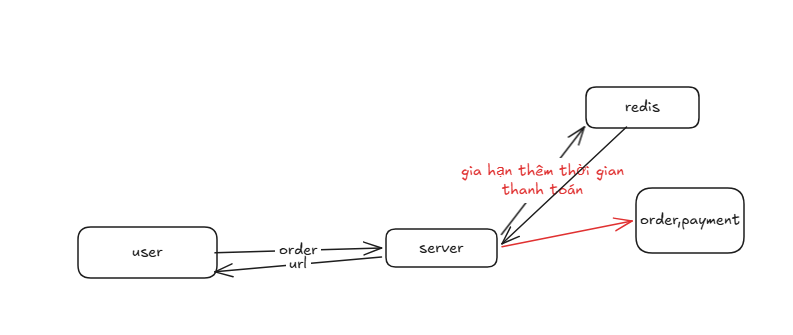
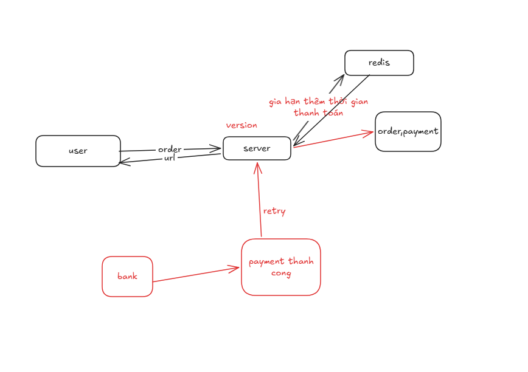
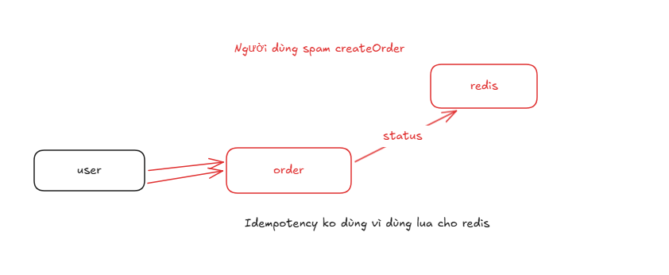
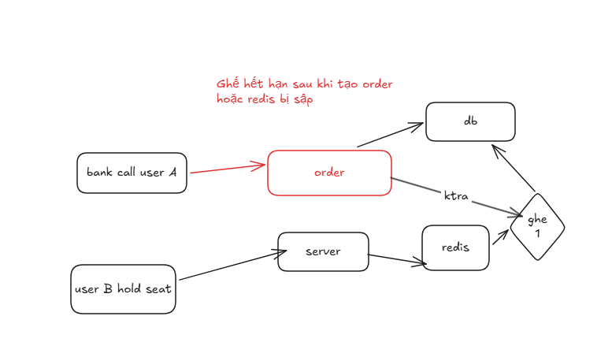

1. tạo thanh toán

- khi user thanh toán tạo order và gia hạn thêm thời gian thanh toán
- khi user thanh toán thành công thì cập nhật trạng thái order là đã thanh toán
2. khi thanh toán thành công hệ thông retry nhiều lần

- xử lý Idempotency
3. Người dùng spam createOrder

4.Ghế hết hạn sau khi tạo order
redis bị tắt có thể gây lỗi

order kiểm tra ghế

