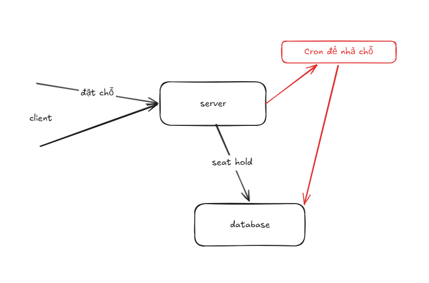
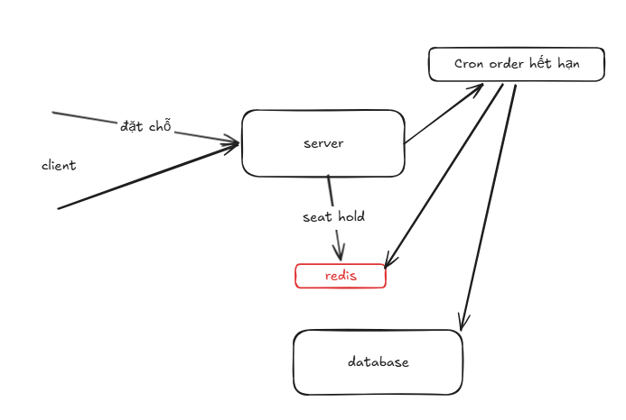
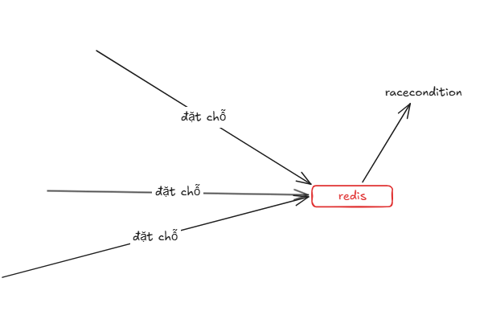
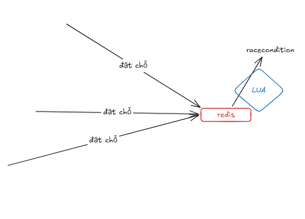

1. vấn đề đặt chỗ và giữ chỗ
- khi client đặt chỗ đối với hệ thống nhỏ với số lượng người thấp có thể đặt chỗ và lưu trong database
- xử lý bằng cách cron nếu hết hạn thanh toán thì nhả lại chỗ 

2. vì sao dùng redis để tối ưu vấn đề đặt chỗ
- redis có tốc độ đọc ghi nhanh hơn database
- redis có thể lưu trữ dữ liệu theo dạng key-value, phù hợp với việc lưu trữ thông tin đặt chỗ như mã đặt chỗ, thời gian hết hạn, và trạng thái thanh toán

3. xử lý racecondition khi nhiều người cùng đặt chỗ
- redis là single-threaded, nếu A và B cùng đặt chỗ khi A get lên 1 lệnh và set 1 lệnh sẽ gây ra racecondition

- sử dụng Lua 
+ nếu A đặt ghế 1 2 3 4; nếu từng lệnh thì khi A GET 1 và SET 1 thì B có thể GET 1 và SET 1 trước khi A SET 1, và C get set 2 3 4 dẫn tới lỗi hệ thống

4. xử lý khi redis bị restart 
- sử dụng persistence:
  RDB (Redis Database Backup) và AOF (Append Only File).
- dự án này ko sử dụng persistence vì dữ liệu đặt chỗ có tính chất tạm thời, nếu redis bị restart thì chỉ mất dữ liệu tạm thời và không ảnh hưởng đến hệ thống tổng thể.
5. xử lý khi redis bị lỗi
- sử dụng Redis Sentinel để giám sát và tự động chuyển đổi sang Redis Replica khi Redis Master gặp sự cố.
- sử dụng Redis Cluster để phân phối dữ liệu và tăng khả năng chịu lỗi.
- xử dụng Monitoring và Alerting để phát hiện và phản ứng nhanh chóng với các sự cố của Redis.
- trong dự án này chưa xử lý redis lỗi.

6. Cache Penetration
sử dụng cache null 
7. Cache Breakdown
8. Cache Avalanche

